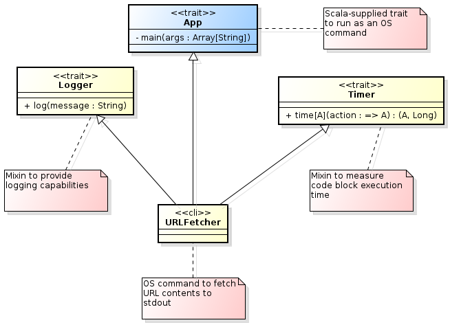

# North Boynton Coders Scala Presentation #

## Simple Spelling Suggestion in Scala ##

This document describes a (rather simplistic) spelling suggestion algorithm
and its evolving implementation in Scala. This implementation starts as an
imperative solution -not unlike what one would write in, say, Java- and is
subsequently modified towards a more functional, Scala-idiomatic style.

## Spelling Checking in a Nutshell ##

In its simplest form, spelling checking is carried out by looking up words
in a dictionary.

Words found in the dictionary are deemed to be correct and, therefore, don't
trigger any suggestion.

Words not found in the dictionary, on the other hand, can be either:

- Legitimate new terms that should be added to the dictionary, or
- Misspellings for which a list of similar words need be provided

## String Similarity ##

The key word above is _similar_: how do we decide whether two words are similar
enough so as to recommend one as a possible replacement for the other?

_String similarity_ algorithms quantify the similarity between pairs of strings.
Customarily, similarity values oscillate between `0` (not at all similar) to `1`
(exactly equal.) String similarity metrics are also referred to as _string distance_
metrics.

There's no shortage of [string similarity metrics](http://en.wikipedia.org/wiki/String_similarity)
but for our purposes we'll play with two popular ones: Levenshtein and JaroWinkler.

The [Levenshtein distance](http://en.wikipedia.org/wiki/Levenshtein_distance) measures the number of characters _edits_ (deletions, transpositions, additions) required to turn one string into another. The higher
the number of edits, the less similar the two strings are. Zero edits means the
strings are one and the the same. Given the maximum length of the two strings, the
number of edits can be expressed as a value between `0` and `1`.

The [Jaro-Winkler distance](http://en.wikipedia.org/wiki/Jaro%E2%80%93Winkler_distance) metric measures character commonality between two strings favoring
those with a common prefix. This algorithm always yields a number between `0` and `1`
and is typically used to compare person names.

For our implementation we'll use Apache Lucene's
[string distance support](http://lucene.apache.org/core/3_5_0/api/contrib-spellchecker/org/apache/lucene/search/spell/StringDistance.html).

### Similarity Examples ###

Consider the following dictionary fragment:

|Word|
|----|
|academic|
|academy|
|accent|
|accept|
|accident|
|account|
|accountant|
|acid|
|count|

The following table shows the similarity scores for the above dictionary words and the misspelled word _academmic_:

|Word|Levenshtein|JaroWinkler|
|----|----------:|----------:|
|academic|0.8889|0.9852|
|academy|0.6667|0.9365|
|acid|0.3333|0.6944|
|accident|0.3333|0.6481|
|accent|0.3333|0.6111|
|accept|0.3333|0.6111|
|account|0.2222|0.5026|
|accountant|0.2000|0.4741|
|count|0.1111|0.4370|

> Note: the above table's markdown was generated with a
> [Scala script](scripts/buildTable.scala).

As we can see, we need to establish a _minimum similarity_ threshold for each metric
in order to weed out not-so-similar terms. In the above example, it would appear that
anything below `0.7` for the Levenshtein metric is probably not similar enough.

### Comparison Explosion ###

In order to be exhaustive, a naïve spelling suggestion implementation would compare
each unknown word with _all_ words in the dictionary collecting only those whose
similarity score is above a configured threshold.

A useful dictionary will contain several tens of thousand words. Comparing each
unknown term with so many words is clearly unacceptable, especially given how costly
a similarity comparison is as opposed to simple string equality

Thus, for a 72k-word dictionary and a Levenshtein threshold of `0.725`, the following
3 typos would require 216,000 similarity comparisons to come up with the few suggestions shown below:

|Typo|Suggestions|
|----|-----------|
|acident|accident, accidents, acridest, incident, occident|
|academmy|academy, academia, academic|
|accountn|account, accounts, accountant, accounting, accounted, accountancy, accountants|

### N-Grams to the Rescue ###

An inexpensive mechanism is needed to avoid performing costly comparisons most of
which will yield scores below the minimum similarity threshold.

As it turns out, string similarity is closely related to character commonality:
the higher a similarity score is for a given pair of string the more characters
they share at the same or very close positions.

An [_n-gram_](http://en.wikipedia.org/wiki/N-gram) is a (generally small) substring
of contiguous characters drawn from a larger string. The _n_ in n-gram corresponds
to its length. Thus, a _bigram_ contains 2 characters, while a _trigram_ contains
3.

The following is the list of all bigrams and trigrams for the (cool!) word _nobocoder_:

|Bigrams|Trigrams|
|:-----:|:------:|
|no|nob|
|ob|obo|
|bo|boc|
|oc|oco|
|co|cod|
|od|ode|
|de|der|
|er|

It's not hard to see that _nobocoder_ and _novocoder_ share 7 of their 8 bigrams and
6 of their 7 trigrams. N-Gram distance is, in fact, a similarity metric in its own right (albeit somewhat less effective for our purposes than, say, Levenshtein).

For short strings such as dictionary words, restricting word pairs to those sharing
at least _one_ bigram expunges a surprisingly high number of otherwise wasteful comparisons.

Equipped with this knowledge we can now identify the data structures needed by our
basic algorithm.

## Spelling Data Structures ##

Spelling suggestion requires two operations:

- Determining whether a given word occurs in the dictionary or not
- For a given unknown word, determining what known words are sufficiently
  similar to it

### Word Membership ###
A `Set` is the appropriate data structure to efficiently ascertain word
membership. In Scala this would look like:

```scala
val dictionary = Set("academic", "academy", "accent", "accept", "accident", "account", "accountant", "acid", "count")
...
val someWord = "..."
...
println(if (dictionary contains someWord) "Sure enough" else s"Whaddaya mean $someWord?") 
```

### Finding Similar Words ###

Finding similar words is a bit more involved: we need a `Map` connecting each
bigram to the `Set` of words in which it occurs.

Thus, for our above dictionary fragment, the bigram-to-wordset map would be:

|Bigram|Word Set|
|:----:|---------|
|ac|academic, academy, accent, accept, accident, account, accountant, acid|
|ad|academic, academy|
|an|accountant|
|ca|academic, academy|
|cc|accent, accept, accident, account, accountant|
|ce|accent, accept|
|ci|accident, acid|
|co|account, accountant, count|
|de|academic, academy, accident|
|em|academic, academy|
|en|accent, accident|
|ep|accept|
|ic|academic|
|id|accident, acid|
|mi|academic|
|my|academy|
|nt|accent, accident, account, accountant, count|
|ou|account, accountant, count|
|pt|accept|
|ta|accountant|
|un|account, accountant, count|

Given this map, let's consider the typo _accet_. This typo has the following
bigrams:

|Typo|Bigrams|
|----|:-----:|
|accet|ac|
||cc|
||ce|
||et|

Extracting the words associated with these bigrams from our map we obtain:

|Typo|Bigram|Related Words|
|----|:----:|-----|
|accet|ac|academic, academy, accent, accept, accident, account, accountant, acid|
||cc|accent, accept, accident, account, accountant|
||ce|accent, accept|
||et|_no matching words_|

The union set of these related words is:

|Typo|Related Words|
|----|-------------|
|accet|academic|
||academy|
||accent|
||accept|
||accident|     
||account|
||accountant|                                                                                                                                                                  ||acid|

We can now compare our typo _accet_ with each of these related words using the
Levenshtein similarity metric:

|Typo|Word|Score|
|----|----|-----|
|accet|accent|0.8333|
||accept|0.8333|
||accident|0.6250|
||account|0.5714|
||academy|0.4286|
||accountant|0.4000|
||acid|0.4000|
||academic|0.3750|

With a minimum similarity of `0.75` only the words _accent_ and _accept_ would be
returned as suggestions.

The data structure we need to locate similar words is a `Map` where the keys are
bigrams (`String`) and the values are the list of words containing the bigram
(`Seq[String]`).

## Spelling Suggestion Algorithm ##

We can now sketch our algorithm in Scala as follows:

```scala
val ngram2words: Map[String, Seq[String]] = ... // Initialize map of ngram to word list here
...
def ngram(word: String, length: Int = 2): Seq[String] = ... // Extract n-grams from word for a given length
...
val levenshtein = new org.apache.lucene.search.spell.LevensteinDistance
val minSimilarity = 0.75
...
val typo = "novocoder"
...
val suggestions: Seq[String] =
  ngram(typo). // extract bigrams from typo
  flatMap(ngram2words). // replace each bigram by its associated words
  distinct. // remove duplicate words
  map(word => (word, levenshtein.getDistance(word, typo))) // compare each word with typo
  filter(_._2 >= minSimilarity). // remove words not sufficiently similar
  sortBy(-_._2). // sort in descending similarity order (more similar words first)
  map(_._1) // extract only the word, leaving out the similarity score
```

Don't worry about the seemingly cryptic syntax; as we advance in our presentation
things will fall neatly into place.

For now, note how compact the suggestion compilation logic looks thanks to Scala's
functional collections!

## Scala as a Scripting Language ##

Despite being a strongly-typed language Scala has the refreshing feel of dynamic languages like Ruby and Python. Type annotations, in particular, are most often optional due to Scala's
[_type inference_](http://en.wikipedia.org/wiki/Type_inference).

Scala can also be used as a scripting language: free-form scripts don't need to reside in
enclosing classes and can be run without a compilation step.

For this Scala has an interactive mode called the [_REPL_](http://en.wikipedia.org/wiki/Read%E2%80%93eval%E2%80%93print_loop)
(read-eval-print loop,) a powerful concept pioneered by Lisp and now quite common among
scripting and functional languages. REPL's foster a development style dubbed
[_exploratory programming_](http://en.wikipedia.org/wiki/Exploratory_programming)
which fits functional programming especially well.

To illustrate Scala's feel as a scripting language let's write a quick'n'dirty
implementation of the naïve approach to spelling suggestion. For this, we'll asume we have
a disk file containing the dictionary, one word per line.

```scala
// Load dictionary from file
val dictionary = io.Source.fromFile("files/words.txt").getLines.toSet

// Build the similarity scorer
val minSimilarity = 0.75
val levenshtein = new org.apache.lucene.search.spell.LevensteinDistance

// Set the terms being examined
val terms = Seq("good", "word", "here", "badd", "wurd", "herre", "notaword")

terms foreach { term =>
  if (!(dictionary contains term))
    dictionary foreach { knownWord =>
      if (levenshtein.getDistance(term, knownWord) >= minSimilarity)
        println(s"$term: did you mean $knownWord?")
    }
}
```

When run, the above script will output:

>
badd: did you mean bald?  
badd: did you mean band?  
badd: did you mean bade?  
badd: did you mean bad?  
badd: did you mean bard?  
badd: did you mean add?  
badd: did you mean baud?  
wurd: did you mean kurd?  
wurd: did you mean curd?  
wurd: did you mean ward?  
wurd: did you mean turd?  
wurd: did you mean word?  
herre: did you mean here?  

Let's dissect this script.

### Loading the Dictionary from Disk ###

Loading the dictionary from disk into a set is pleasantly simple:

```scala
import io.Source
val dictionary = Source.fromFile("files/words.txt").getLines.toSet
```

Scala provides the `io.Source` class to perform read operations on a variety of input
sources. The `fromFile` function opens a file for reading and returns an instance of
`Source`. This class has a `getLines` method yielding a string iterator to
read each line in the file. `Iterator`, in turn, provides a `toSet` method that builds
a `Set`  suitable for efficient membership testing. Cool!

### Creating the Similarity Scorer ###

Next, we build a similarity scorer using Lucene's implementation of the Levenshtein
(or, as they prefer to spell it, _levenstein_) algorithm:

```scala
// Build the similarity scorer
import org.apache.lucene.search.spell._

val minSimilarity = 0.75
val levenshtein = new LevensteinDistance
```

`LevensteinDistance` provides a `getDistance` method that computes the similarity between
2 strings:

```scala
levenshtein.getDistance("nobocder", "novocoder") // yields: 0.8888889
```
### Feeding (dummy) Test Data ###

We then populate a list of test terms to exercise our suggestion approach:

```scala
val terms = Seq("good", "word", "here", "badd", "wurd", "herre", "notaword")
```

We won't be getting any output for the first 3 "good" words. We should get suggestions
for the next 3 "bad" ones, as they do ressemble dictionary words. For the last "notaword"
term we should get an indication that no dictionary word is sufficiently similar.

### Locating Similar Words ###
We're now ready to visit each term and test if it exists in the dictionary;
if it doesn't we traverse the dictionary collecting words similar to the
term:

```scala
terms foreach { term =>
  if (!(dictionary contains term))
    dictionary foreach { knownWord =>
      if (levenshtein.getDistance(term, knownWord) >= minSimilarity)
        println(s"$term: did you mean $knownWord?")
    }
}
```

>
Note: instead of saying _`foreach term in terms { ... }`_ in Scala we say
`terms foreach { ... }`. This is so because `foreach` is actually a _method_
defined on collections. This method takes a block of code as argument. Thus,
if we want to print all terms we say `terms.foreach(println)`. Expressive!

In the above code snippet we filter out the terms occurring in the dictionary and
then, for each unknown word, we collect its similar dictionary words.
We achieve this by means of `foreach` and `if` (ugh!).

### Functional Collections ###

In functional programming, common operations on collections are implemented as _functions_
(in Scala, methods) so that the programmer is not required to endlessly write loops and
conditionals.

Thus, a more idiomatic way to write our word-collecting loop is:

```scala
terms.
  filter(term => !(dictionary contains term)).
  foreach { term =>
    val similars = dictionary filter { word =>  
      levenshtein.getDistance(term, word) >= minSimilarity  
    }
    if (similars isEmpty)
      println(s"Whaddaya mean '$term'?")
    else
      println(s"$term: you probably meant one of $similars")
  }
```

This will output:
>
badd: you probably meant one of Set(bad, bald, band, bade, bard, add, baud)  
wurd: you probably meant one of Set(word, kurd, curd, ward, turd)  
herre: you probably meant one of Set(here)  
Whaddaya mean 'notaword'?

This humble code snippet has a wealth of useful information for us. Let's embark!

### Filtering Collections ###
Our first step is to filter out terms appearing in the dictionary:

```scala
terms.filter(term => !(dictionary contains term))
```

Here, we visit each element in the `terms` collection selecting only those elements matching
the `filter` predicate (namely, that the given term is not contained in the dictionary.)

`filter` is a collection method that takes as argument a block of code to be executed for
each element in the collection. This block of code returns a `Boolean` value indicating
whether the given element satisfies a predicate or not. If it does, the element is included
in the output collection; otherwise, it is omitted.

### Anonymous Functions (Lambdas) ###

Blocks of code passed as arguments are referred to as [_lambdas_](http://en.wikipedia.org/wiki/Anonymous_function). This construction is very familiar to
Rubyists and Pythonistas and has found its way into strongly typed languages such as C#,
C++ and Java. It's been present forever in functional languages such as Haskell and Lisp.

In order to refer to the current element inside our lambda we start the code block with
a variable name followed by a fat arrow, followed by the actual predicate:

```scala
term => !(dictionary contains term)
```

Any variable name will do for the lambda argument as long as we use it consistently in the
body:

```scala
someWord => !(dictionary contains someWord)
```

### Anonymous Lambda Arguments ###

In scala, when the lambda argument is used only once in the body it can be replaced by
the underscore anonymous variable (`_`). Thus our filter expression could be rewritten as:

```scala
terms.filter(!dictionary.contains(_))
```

Scala's underscore is roughly equivalent to Groovy's and Xtend's `it` implicit lambda
argument.

In our specific case, because we're negating the dictionary membership test, we could use
the `filterNot` function instead of `filter`:

```scala
terms.filterNot(dictionary.contains(_))
```

### Functions as Arguments ###

We have room for one further simplification: when a lambda body consists
of a single function whose only argument is the lambda argument itself then we can pass
just the function name. Thus, instead of

```scala
terms.filterNot(dictionary.contains(_))
```

We can just say:

```scala
terms.filterNot(dictionary.contains) // Look ma: no argument, not even an underscore!
```

This may look a bit terse at first but, for the trained eye, it's actually much more legible
and informative.

Why? Functional programming emphasizes _what_ is to be done rather than _how_ to do it. This
is achieved by expressing computations as a succession of data transformations rather than
operations modifying data in place.

Thus, when we see `terms.filterNot(dictionary.contains)` it reads like "weed out terms
not contained in the dictionary." We emphasize what the filtering function does rather
than how to call it.

### Functional Collection Transformations ###

Processing data through successive transformations on collections is a time-honored
concept. Let's recall the classic, sales-pitch Unix example:

```bash
cat *.txt |  # Collect the text files
tr A-Z a-z |  # Make all words lowercase
tr -cs a-z '\012' |  # Remove non-alphas, outputting each word on a separate line
sort -u -o dictionary.txt  # Order by word -suppressing duplicates- onto dictionary file
```

Wow, we can build a dictionary with four simple commands in a single pipeline!

This style of successive collection transformation is the basis of our early formulation
of the spelling suggestion algorithm:

```scala
val suggestions =
  ngram(typo). // extract bigrams from typo
  flatMap(ngram2words). // replace each bigram by its associated words
  distinct. // remove duplicate words
  map(word => (word, levenshtein.getDistance(word, typo))) // compare each word with typo
  filter(_._2 >= minSimilarity). // remove words not sufficiently similar
  sortBy(-_._2). // sort in descending similarity order (more similar words first)
  map(_._1) // extract only the word, leaving out the similarity score
```

### Separating Data Production from Data Consumption ###

Let's continue with the remaining part of our suggestion script:

```scala
foreach { term =>
  val similars = dictionary filter(levenshtein.getDistance(term, _) >= minSimilarity)
  if (similars isEmpty)
    println(s"Whaddaya mean '$term'?")
  else
    println(s"$term: you probably meant one of $similars")
}
```

Here, for each term not in our dictionary, we identify what dictionary words are similar
by the brute-force method of comparing the unknown term with every word in the dictionary (yes, we'll improve upon this later.) We then complain if there are no similar words
or show a list of suggestions otherwise.

This snippet has something smelly about it: it incurs in the sin of consuming
the data in the same context in which it is produced. This practice hinders reuse and makes
code difficult to understand and modify.

A better way is to store unkown terms and their associated suggestions in a variable and
then, in a separate step, make use of them by printing messages, sending them over the wire
or storing them in a database:

```scala
// Collect the data...
val suggestions = terms.
    filterNot(dictionary.contains).
    map { term =>
      val similars = dictionary filter(levenshtein.getDistance(term, _) >= minSimilarity)
      (term, similars)
    }
    
// ... then use it
suggestions foreach { case(term, similars) =>
  if (similars.isEmpty)
    println(s"Whaddaya mean '$term'?")
  else
    println(s"$term: you probably meant one of $similars")
}
```

### Mapping Collections ###

To build the suggestion list above, we filter out terms present in the dictionary and then
we use the collection method `map` to convert each unknown term into a tuple containing
the term and its similars.

Like `filter`, `map` takes as argument a function that accepts each collection element,
but whereas `filter` matches elements, `map` _transforms_ them. Thus, the collection
resulting from applying `map` has as many elements as the input collection:

```scala
"nobocoder".map(_.toUpper) // yields: "NOBOCODER"
```

Let's make further use of `map` in our snippet to sort the term's similar words so that
the most similar ones are presented first:

```scala
val similars = dictionary.
  toSeq. // Convert dictionary `Set` to `Seq` so as to enable sorting
  map(word => (word, levenshtein.getDistance(term, word))). // Build tuple (word, similarity)
  filter(_._2 >= minSimilarity). // Remove not similar words
  sortBy(-_._2). // Order by second tuple element (similarity)
  map(_._1) // Produce only first tuple element (word)
```

### A Word on Tuples ##

A _tuple_ is a group of unnamed values possibly with different data types:

```scala
val score: (String, String, Float) = ("herre", "here", 0.8)
```

In the above snippet we have:

```scala
map(word => (word, levenshtein.getDistance(term, word))). // Build tuple (word, similarity)
```

The expression `(word, levenshtein.getDistance(term, word))` defines a 2-element
tuple where the first element is a `String` (the dictionary word) and the second
element is a `Float` (the Levenshtein distance between the dictionary word and
the unknown term).

Scala tuple members are referenced positionally with an underscore followed by
the position:

```scala
val wordSimilarity = ("herre", 0.8)
println(wordSimilarity._1) // prints: here
println(wordSimilarity._2) // prints: 0.8
```

### Concatenating Collections ###

Lastly, let's modify the printing of spelling suggestions to format the ordered set of
similar words as a comma-separated, parenthesis-enclosed list:

```scala
suggestions foreach { case(term, similars) =>
  if (similars.isEmpty)
    println(s"Whaddaya mean '$term'?")
  else
    println(s"$term: you probably meant one of ${similars.mkString("(", ", ", ")")}")
}
```

This yields:
>
baad: you probably meant one of (baaed, brad, bald, baal, band, bead, bad, bard, baas, baa, baud)  
worrd: you probably meant one of (worry, world, word)  
herre: you probably meant one of (here)  
Whaddaya mean 'notaword'?

The `mkString` function takes a collection and produces a string formed by the
concatenation of all elements with a prefix, a separator and a suffix:

```scala
val literaryNumbers = Seq(22, 42, 69)
literaryNumbers.mkString("{", ", ", "}") // yields: {22, 42, 69}
```

### Are We There Yet? ###

Let's take a look at our revised version so far:

```scala
val dictionary = io.Source.fromFile("files/words.txt").getLines.toSet

val minSimilarity = 0.75
val levenshtein = new org.apache.lucene.search.spell.LevensteinDistance

val terms = Seq("good", "word", "here", "badd", "wurd", "herre", "notaword")

val suggestions = terms.
  filterNot(dictionary.contains).
  map { term =>
    val similars = dictionary.toSeq.
      map(word => (word, levenshtein.getDistance(term, word))).
      filter(_._2 >= minSimilarity).
      sortBy(-_._2).
      map(_._1)

    (term, similars)
  }

suggestions foreach { case(term, similars) =>
  if (similars.isEmpty)
    println(s"Whaddaya mean '$term'?")
  else
    println(s"$term: you probably meant one of ${similars.mkString("(", ", ", ")")}")
}
```

Almost there...

### Monadic `for` ###

A pipeline of collection transformations can quickly grow hard to read and reason
about as the data flowing between steps is unnamed and each step's data datype changes
as the transformation progresses.

Scala provides sweet syntactic sugar for successive collection transformations: the
_monadic `for`_.

Let's recall how we currently build our suggestions to yield a sequence of tuples
containing an unknown term and its similar dictionary words:

```scala
val suggestions = terms.
  filterNot(dictionary.contains).
  map { term =>
    val similars = dictionary.toSeq.
      map(word => (word, levenshtein.getDistance(term, word))).
      filter(_._2 >= minSimilarity).
      sortBy(-_._2).
      map(_._1)

    (term, similars)
  }
```

Let's rephrase this transformation as a monadic `for`:

```scala
val suggestions = for {
  term <- terms
  if !(dictionary contains term)
  similars = {
    val wordSimilarities = for {
      word <- dictionary.toSeq
      similarity = levenshtein.getDistance(term, word)
      if similarity >= minSimilarity
    } yield (word, similarity)
    for {
      (word, similarity) <- wordSimilarities.sortBy(-_._2)
    } yield word
  }
} yield (term, similars)
```

This is definitely an improvement over long transformation one-liners: each step
is now named and we could even annotate it with type information for clarity.

In practice, small transformations are frequently easier to write and read with the
"method chaining" notation. As an example, consider building the dictionary set from
a disk file:

```scala
val dictionary = io.Source.fromFile("files/words.txt").getLines.toSet
```

However, if we were to weed out commented lines and making sure everything is lowercase
we'd probably use a mix of `for` notation and method chaining:

```scala
val dictionary = {
    for {
        line <- io.Source.fromFile("files/words.txt").getLines
        if !line.startsWith("#")
        word = line.toLowerCase
    } yield word
}.toSet
```

It's very important to understand that, behind the scenes, a `for` loop still makes
use of `filter`, `map` and other collection functions. It can be thought of as a
DSL for functional collection transformations.

### The Final Idiomatic Script ###

Uff! We've had a rather long journey to make our humble script idiomatic. Let's
see what we got:

```scala
val dictionary = io.Source.fromFile("files/words.txt").getLines.toSet

val minSimilarity = 0.75
val levenshtein = new org.apache.lucene.search.spell.LevensteinDistance

val terms = Seq("good", "word", "here", "badd", "wurd", "herre", "notaword")

val suggestions = for {
  term <- terms
  if !(dictionary contains term)
  similars = {
    val wordSimilarities = for {
      word <- dictionary.toSeq
      similarity = levenshtein.getDistance(term, word)
      if similarity >= minSimilarity
    } yield (word, similarity)
    for {
      (word, similarity) <- wordSimilarities.sortBy(-_._2)
    } yield word
  }
} yield (term, similars)

for ((term, similars) <- suggestions) {
  if (similars.isEmpty)
    println(s"Whaddaya mean '$term'?")
  else
    println(s"$term: you probably meant one of ${similars.mkString("(", ", ", ")")}")
}
```

## Beyond Scripts: Object-oriented Scala ##

While scripting and exploratory programming are a wonderful way to sketch and refine code,
programming in the large benefits greatly from a rich type system and the organizing
force of objects, traits and classes.

Scala is a strongly typed language with a type system significantly richer than that of Java,
its ancestor in JVM-land. Yet, Scala code is strinkingly less verbose than Java. This is
possible because -unlike Java- Scala doesn't require the programmer to annotate variables
and expressions with type information. The Scala compiler is capable of inferring the
appropriate type of most expressions thus providing the best of both worlds: the economy
of expression of scripting languages with the type safety of industrial-strength programming languages.

### Traits, Objects and Classes ###

Scala classes correspond closely to the notion of class in most object-oriented classes:
they group together fields and functions (methods.) Classes, however, are less 
central to Scala programming than they are in other object-oriented languages.

```scala
class DateFormatter(pattern: String) {
  val formatter = new java.text.SimpleDateFormat(pattern)
  
  def format(date: java.util.Date) = formatter.format(date);
}
```

Like in Java, a class can extend at most one other class. Class inheritance, though, is
far less common in Scala than in other object-oriented languages; more commonly, classes
extend traits.
 
A Scala _trait_ could be compared to a Java interface but it's a much more capable construct. Traits can have fields and method bodies as well as abstract members.
Unlike classes, traits cannot be directly instantiated: traits exist solely
to be extended by other traits, classes or objects.

```scala
trait Formatter[A] {
  def format(a: A): String
}

class DateFormatter(pattern: String) extends Formatter[Date] {
  val formatter = new SimpleDateFormat(pattern)
  
  def format(date: Date) = formatter.format(date);
}
```

While a Scala class can extend at most one other class, it can (and often does) extend
multiple traits. Because traits can carry method and field implementations some people see
this as multiple inheritance but that may not be entirely accurate. Traits are
probably closer to Ruby or Python [mixins](http://en.wikipedia.org/wiki/Mixin): they're
meant for _composition_ rather than inheritance.

```scala
// Logging is mixed-in to provide diagnostic messages
class DateFormatter(pattern: String) extends Formatter[Date] with Logging {
  val formatter = new SimpleDateFormat(pattern)
  
  def format(date: Date) = {
    logger.debug(s"Formatting with pattern '$pattern': $date")
    formatter.format(date);
  }
}
```

In addition to classes and traits, Scala also features _objects_: stand-alone instances
possibly extending a class and/or one or more traits.

```scala
// This canonical example had to appear somewhere
object Greeter extends App {
  println("Hello world")
}

// Voicì un singleton
object Capitalizer extends Formatter[String] {
  def format(string: String) = string.toUpperCase
}
```

Objects can have fields, methods and types of their own in addition to those possibly
inherited from their extended traits or class. Because of this, a Scala object can be viewed as a _module_ (for example, in the Haskell sense of the term.)

```scala
object NGram {
  // A datatype alias
  type NGramMap = Map[String, Seq[String]]
  
  // A data class
  case class Suggestion(unknownTerm: String, similarWords: Seq[String])
  
  // A function
  def ngrams(string: String, length: Int = 2) = ...
}
. . .
import NGram._

val wordNGrams = ngrams("hello") // Equivalent to NGram.ngrams("hello", 2)
val suggestion = Suggestion("herre", Seq("here", "her")) 
```

When an object has the same name of a class or trait it's dubbed their _companion object_.
A companion object doesn't have to extend its associated class or trait (though it may.)
Companion objects frequently provide functions similar to what in Java would
be called _static methods_.

```scala
```

Traits, objects and classes can nest freely:

```scala
```

Overall, Scala programming revolves mostly around traits and objects. Classes are
more commonly used to hold immutable data in the form of _case classes_.

### Traits, Objects and Classes: an Example ###

Let's consider a command-line application to grab the contents of a URL and transcribe
it to the standard output: a `cat`-like command to display URL's.

In its minimal form, the `URLFetcher` application would look like:

```scala
import io.Source

object URLFetcher extends App {
  val DefaultURL = "http://scala-lang.org"
  val url = if (args.length == 0) DefaultURL else args(0)

  print(Source.fromURL(url).mkString)
}
```

A command-line application needs to be an _object_ (not a class!) extending the
standard `App` trait.

Scala code inside the object is directly executable; there's no need for a
`main(args: Array[String])` function.

In this skeletal form, our `App` will fetch a URL passed as a command argument. In
absence of an explicit URL argument it will default to `http://scala-lang.org`.

The `print` function writes to the process' standard output (without appending a trailing
newline.)

`Source.fromURL(url)` opens the given URL for reading. The trailing `mkString` method
reads the entire URL contents into a string.

If we run our application with:

```bash
scala URLFetcher http://localhost
```

We'd see something like:

```
<html>
<head><title>It works!</title></head>
<body>
  <h1>It works!</h1>
</body>
</html>
```

### Adding Trait Mixins ###

Let's add some additional functionality to our command-line application:

- The ability to measure the execution time of a block of code
- The ability to produce logging messages



To measure the execution time of a block of code we need the following trait:

```scala
trait Timer {
  def time[A](action: => A) = {
    val startTime = System.currentTimeMillis()
    val result = action
    val endTime = System.currentTimeMillis()
    (result, endTime - startTime)
  }
}
```

This trait defines a function `time` that:

- takes as argument a code block (`action`) returning a typed value, and
- returns a tuple with the code block result and the elapsed time in milliseconds

If we mix this trait into our application we have:

```scala
object URLFetcher extends App with Timer {
  val DefaultURL = "http://scala-lang.org"
  val url = if (args.length == 0) DefaultURL else args(0)

  val (contents, elapsedTime) = time(Source.fromURL(url).mkString)
  print(contents)

  System.err.println(s"Elapsed time: $elapsedTime milliseconds")
}
```

To log messages with a timestamp we need the following trait:

```scala
trait Logger {
  val dateFormat = new java.text.SimpleDateFormat("yyyy-MM-dd hh:mm:ss")

  def log(message: String) {
    System.err.println(s"[${dateFormat.format(new java.util.Date)}] $message")
  }
}
```

After mixin this trait to our application we have:

```scala
object URLFetcher extends App with Timer with Logger {
  val DefaultURL = "http://scala-lang.org"
  val url = if (args.length == 0) DefaultURL else args(0)

  val (contents, elapsedTime) = time(Source.fromURL(url).mkString)
  print(contents)

  log(s"Elapsed time: $elapsedTime milliseconds")
}
```

When we run this application we see, in addition to the URL contents, a trailing
stderr line like the following:

```
[2014-03-16 07:57:44] Elapsed time: 48 milliseconds
```


